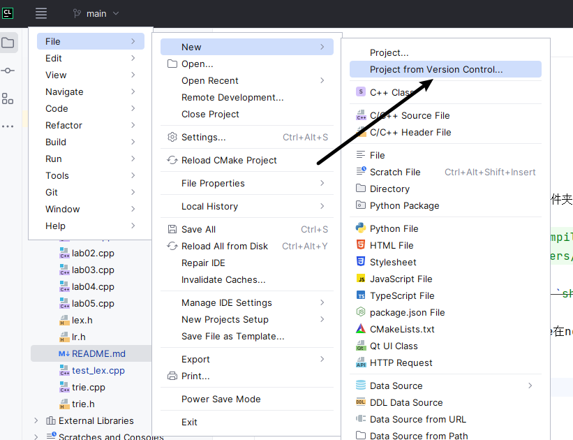

## 编译原理实验
- lab01 词法分析
- lab02 文法整理
- lab03 去除左递归和提取左因子
- lab04 LL parser
- lab05 LR parser

如果想在vscode使用调试功能，只需要修改`.vscode`文件夹下`launch.json` 中以下两处的路径
```json
"program": "/root/trace/learning/course/compilers/lab03",
"cwd": "/root/trace/learning/course/compilers/",
```
~~在 makefile 里配置好的实验，可以通过 `ctrl` + `shift` + `B` 直接运行
(前提是安装了 make)~~
更新了CmakeList, 不需要再使用make, 旧的makefile在notes文件夹下。
如何运行程序？
1. 从Clion直接导入项目

2. 命令行运行
```bash
# cd 进入项目文件夹
cd build
cmake ../
make
# OK 成功生成所有可执行文件
```