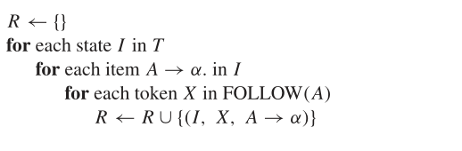

# LR(0)
## How draw a action table
- 首先你需要画出文法对应的DFA

- 按照四点原则填表

## SLR(1) 文法

- 为什么我们需要slr 1 文法
有的时候，某一个状态即可以规约，又可以移进，这个时候编译器就不知道到底做什么操作。
比如在以下例子中，该状态既可以移近，也可以规约。
$$
E \to T . + E \\
E \to T .
$$

- 如何使用SLR文法解决冲突

# chapter 6  属性文法

# chapter 7 语义分析 中间代码生成

## 静态语义检查
- 类型检查
- 控制流检查
- 一致性检查
- 相关名字检查

## 中间代码生成
some question

